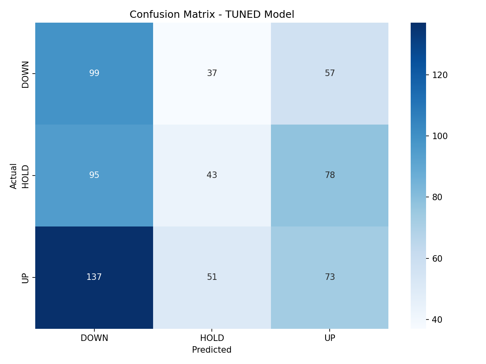
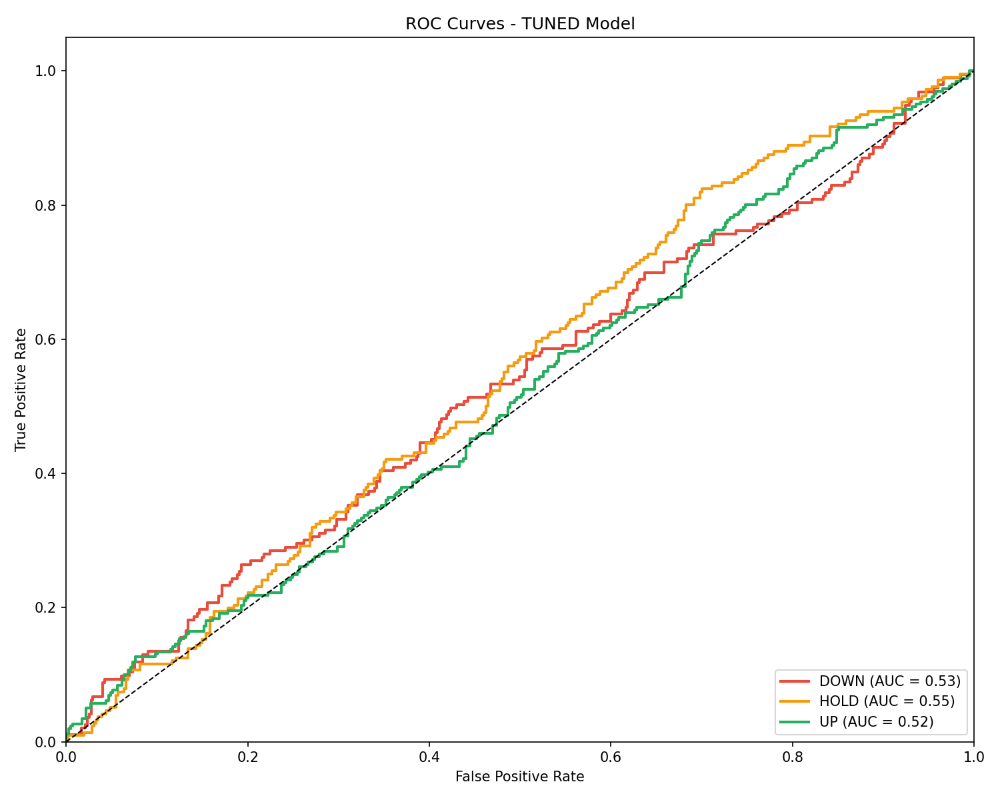
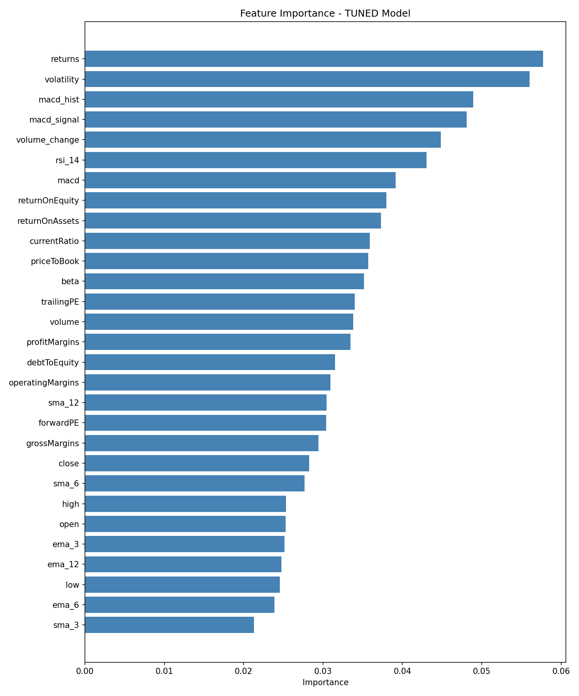
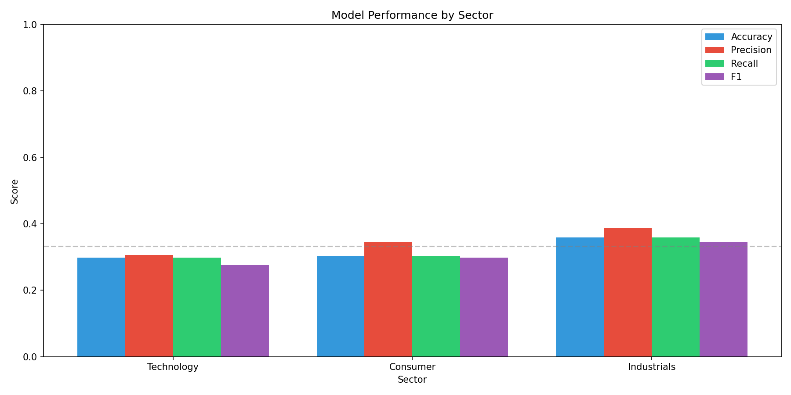

# 🎯 CleanSolution - Klasifikace Cenových Pohybů Akcií pomocí ML

## Diplomová Práce - Ing. Informatika

**Autor:** Bc. Jan Dub  
**Datum:** Prosinec 2025

---

## 📖 O Projektu

Tento projekt implementuje **hybridní přístup k predikci směru cenových pohybů akcií** kombinací:

1. **Random Forest Regressor** - pro imputaci chybějících historických fundamentálních dat
2. **Random Forest Classifier** - pro klasifikaci budoucích cenových pohybů (DOWN/HOLD/UP)

### 🔑 Klíčová Inovace

Projekt řeší fundamentální problém v kvantitativních financích: **neúplnost historických fundamentálních dat**. Zatímco cenová data (OHLCV) jsou dostupná za 10+ let, fundamentální metriky (P/E, ROE, atd.) jsou typicky dostupné pouze za 1-2 roky.

**Řešení:**
1. Natrénovat ML model na období, kde máme kompletní data (OHLCV + Fundamenty)
2. Použít tento model k rekonstrukci chybějících fundamentálních dat
3. Klasifikovat budoucí cenové pohyby na základě kompletního datasetu

### 🎯 Klasifikační Přístup

| Aspekt | Klasifikace |
|--------|-------------|
| **Output** | Třída pohybu (DOWN/HOLD/UP) |
| **Interpretace** | "Cena vzroste/klesne o >3%" |
| **Praktické využití** | Přímé trading signály |
| **Robustnost** | Robustní vůči outliers |
| **Evaluace** | Accuracy, Precision, Recall, F1 |

**Definice tříd (±3% threshold):**
- **DOWN (0):** Měsíční výnos < -3%
- **HOLD (1):** Měsíční výnos mezi -3% a +3%
- **UP (2):** Měsíční výnos > +3%

Threshold 3% odpovídá minimálnímu profitabilnímu pohybu po započtení transakčních nákladů.

---

## 📂 Struktura Projektu

```
CleanSolution/
│
├── 📄 README.md                              # Tento soubor
├── 📄 DOKUMENTACE_30tickeru_3sektory_postup.md  # 📊 HLAVNÍ DOKUMENTACE experimentu
├── 📄 QUICKSTART.md                          # Rychlý start pro Colab
├── 📄 requirements.txt                       # Python závislosti
│
├── 📂 notebooks/                             # Jupyter Notebooky pro Google Colab
│   └── ...
│
├── 📂 scripts/                               # Pomocné Python skripty
│   └── ...
│
├── 📂 data/                                  # 📊 DATOVÉ SOUBORY
│   │
│   └── 📂 30_tickers/                       # 🎯 EXPERIMENT: 30 tickerů (10 per sektor)
│       ├── 📂 ohlcv/                        # Surová OHLCV data
│       ├── 📂 fundamentals/                 # Fundamentální data
│       ├── 📂 complete/                     # Kompletní dataset
│       └── 📂 figures/                      # Vizualizace výsledků
│   
│   # Budoucí experimenty:
│   # ├── 📂 50_tickers/
│   # ├── 📂 100_tickers/
│   # └── 📂 150_tickers/
│
├── 📂 models/                                # 🤖 ULOŽENÉ ML MODELY
│   │
│   └── 📂 30_tickers/                       # 🎯 MODELY: 30 tickerů
│       ├── 📂 classifiers/                  # RF Classifier modely
│       ├── 📂 regressors/                   # RF Regressor modely
│       ├── 📂 scalers/                      # StandardScaler objekty
│       └── 📂 metadata/                     # Výsledky a hyperparametry
│   
│   # Budoucí experimenty:
│   # ├── 📂 50_tickers/
│   # ├── 📂 100_tickers/
│   # └── 📂 150_tickers/
│
├── 📂 docs/                                  # Dokumentace
│   └── ...
│
├── 📂 archive/                               # Archivované staré skripty
│   └── ...
│
└── 📄 Skripty pro pipeline:
    ├── download_30_tickers.py
    ├── download_fundamentals.py
    ├── train_rf_regressor.py
    ├── train_rf_classifier.py
    ├── hyperparameter_tuning.py
    └── final_evaluation.py
```

### 📁 Proč podsložky `30_tickers/`?

Struktura umožňuje **snadné porovnání experimentů** s různým počtem tickerů:

| Experiment | Tickerů | Accuracy | Složka |
|------------|---------|----------|--------|
| 30 tickerů | 30 | 32.1% | `data/30_tickers/`, `models/30_tickers/` |
| 50 tickerů | 50 | ? | `data/50_tickers/`, `models/50_tickers/` |
| 100 tickerů | 100 | ? | `data/100_tickers/`, `models/100_tickers/` |

### 📁 Popis klíčových složek
├── 📂 archive/                               # Archivované staré skripty
│   └── ...
│
└── 📄 Skripty pro pipeline (30 tickerů):
    ├── download_30_tickers.py               # Krok 1: Stažení OHLCV
    ├── download_fundamentals.py             # Krok 2: Stažení fundamentů
    ├── train_rf_regressor.py                # Krok 3-4: RF Regressor + imputace
    ├── train_rf_classifier.py               # Krok 5: RF Classifier
    ├── hyperparameter_tuning.py             # Krok 6: Grid Search tuning
    └── final_evaluation.py                  # Krok 7: Evaluace + grafy
```

### 📁 Popis klíčových složek

| Složka | Účel | Obsah |
|--------|------|-------|
| `data/30_tickers/ohlcv/` | Surová cenová data | OHLCV z yfinance |
| `data/30_tickers/fundamentals/` | Fundamentální metriky | P/E, ROE, ROA, atd. |
| `data/30_tickers/complete/` | **Kompletní dataset** | OHLCV + fundamenty (imputované) |
| `data/30_tickers/figures/` | **Vizualizace** | Grafy pro diplomovou práci |
| `models/30_tickers/classifiers/` | Klasifikátory | RF Classifier modely (.pkl) |
| `models/30_tickers/regressors/` | Regresory | RF Regressor pro imputaci |
| `models/30_tickers/scalers/` | Scalery | StandardScaler objekty |
| `models/30_tickers/metadata/` | Metadata | JSON/CSV s výsledky |

---

## 🚀 Rychlý Start (Google Colab)

### Doporučený Workflow

Všechny ML operace jsou implementovány v **Jupyter Noteboocích** optimalizovaných pro Google Colab.

**Postup:**

1. **Nahrajte data do Google Drive:**
   ```
   Google Drive/
   └── MachineLearning/
       └── data_10y/
           ├── Technology_full_10y.csv
           ├── Consumer_full_10y.csv
           └── Industrials_full_10y.csv
   ```

2. **Otevřete notebooky v Google Colab (v pořadí):**

   | # | Notebook | Popis | Doba |
   |---|----------|-------|------|
   | 1 | `01_Data_Collection.ipynb` | Teoretický úvod, stahování dat | ~10 min |
   | 2 | `02_Train_Fundamental_Predictor.ipynb` | Trénink RF Regressor | ~5 min |
   | 3 | `03_Complete_Historical_Data.ipynb` | Imputace chybějících dat | ~2 min |
   | 4 | `04_Train_Price_Classifier.ipynb` | Trénink RF Classifier | ~5 min |
   | 5 | `05_Hyperparameter_Tuning.ipynb` | Optimalizace hyperparametrů | ~15 min |
   | 6 | `06_Final_Evaluation.ipynb` | Evaluace + grafy pro DP | ~5 min |

3. **Každý notebook obsahuje:**
   - 📚 Teoretický úvod s akademickými vysvětleními
   - 📊 Matematické vzorce (LaTeX)
   - 💻 Spustitelný Python kód
   - 📈 Vizualizace výsledků
   - 💾 Automatické ukládání do Google Drive

---

## 📊 Metodologie

### Fáze 1: Sběr Dat
- **OHLCV data:** 10 let měsíční historie (2015-2025) pro 150 S&P 500 akcií
- **Technické indikátory:** RSI, MACD, SMA, EMA, volatilita
- **Fundamentální data:** 11 metrik (P/E, ROE, Debt/Equity, atd.)
- **Sektory:** Technology, Consumer Discretionary, Industrials

### Fáze 2: Imputace Dat (Random Forest Regressor)
- **Problém:** Fundamentální data dostupná pouze za 1.5 roku
- **Řešení:** Multi-output RF natrénovaný na vztahu OHLCV → Fundamenty
- **Výstup:** Kompletní dataset 2015-2025

### Fáze 3: Klasifikace (Random Forest Classifier)
- **Input:** OHLCV + Technické + Fundamentální features
- **Output:** Ternární klasifikace (DOWN/HOLD/UP)
- **Validace:** Chronologický split + TimeSeriesSplit

### Fáze 4: Evaluace
- Confusion Matrix, ROC křivky
- Per-sector analýza
- Backtesting obchodní strategie
- Feature Importance

---

## 📈 Výsledky (30 tickerů, 3 sektory)

### Experiment: Prosinec 2025

📊 **Kompletní dokumentace:** [DOKUMENTACE_30tickeru_3sektory_postup.md](DOKUMENTACE_30tickeru_3sektory_postup.md)

### Dataset

| Metrika | Hodnota |
|---------|---------|
| Tickerů | 30 (10 per sektor) |
| Období | 10.7 let (2014-2024) |
| Celkem vzorků | 3,380 |
| Features | 29 (OHLCV + technické + fundamenty) |

### RF Regressor (imputace fundamentů)

| Target | R² Score |
|--------|----------|
| trailingPE | 0.957 |
| forwardPE | 0.964 |
| returnOnAssets | 0.970 |
| debtToEquity | 0.765 |

### RF Classifier (klasifikace pohybů)

| Metrika | Hodnota |
|---------|---------|
| Accuracy | 32.1% |
| F1-Score | 31.0% |
| Random baseline | 33.3% |

### Per-Sector výsledky

| Sektor | Accuracy | F1-Score |
|--------|----------|----------|
| Industrials | **35.9%** | 34.6% |
| Consumer | 30.4% | 29.8% |
| Technology | 29.8% | 27.6% |

### Top 5 Features

1. `returns` (0.058)
2. `volatility` (0.056)
3. `macd_hist` (0.049)
4. `macd_signal` (0.048)
5. `volume_change` (0.045)

### Vizualizace

| Graf | Popis |
|------|-------|
|  | Matice záměn |
|  | ROC křivky |
|  | Důležitost features |
|  | Porovnání sektorů |

### Klíčová Zjištění

- ✅ RF Regressor excelentně imputuje fundamenty (R² 0.76-0.97)
- ✅ Technické indikátory (returns, volatility, MACD) jsou nejdůležitější
- ✅ Industrials sektor je nejlépe predikovatelný
- ⚠️ Accuracy ~32% je typická pro finanční predikce (mírně nad random)
- ⚠️ HOLD třída je nejhůře rozpoznávaná (20% recall)

---

## 📚 Dokumentace

| Dokument | Obsah |
|----------|-------|
| [METHODOLOGY.md](docs/METHODOLOGY.md) | Kompletní metodologie projektu |
| [MATHEMATICAL_FOUNDATIONS.md](docs/MATHEMATICAL_FOUNDATIONS.md) | Matematické základy algoritmů |
| [ALGORITHM_SELECTION.md](docs/ALGORITHM_SELECTION.md) | Zdůvodnění výběru algoritmů |
| [WORKFLOW.md](docs/WORKFLOW.md) | Detailní průvodce workflow |
| [QUICKSTART.md](QUICKSTART.md) | Rychlý start |

---

## 🛠️ Lokální Spuštění (Volitelné)

Pokud preferujete lokální prostředí místo Google Colab:

```bash
# 1. Klonujte repozitář
git clone https://github.com/user/MachineLearning.git
cd MachineLearning/CleanSolution

# 2. Vytvořte virtuální prostředí
python -m venv venv
source venv/bin/activate  # Linux/Mac
# nebo: .\venv\Scripts\activate  # Windows

# 3. Nainstalujte závislosti
pip install -r requirements.txt

# 4. (Volitelné) Stáhněte data
python scripts/0_download_prices.py
python scripts/1_download_fundamentals.py

# 5. Spusťte Jupyter
jupyter lab
```

---

## 📜 Licence

MIT License - viz [LICENSE](../LICENSE)

---

## 👤 Autor

**Bc. Jan Dub**  
Diplomová práce - Ing. Informatika  
Prosinec 2025
